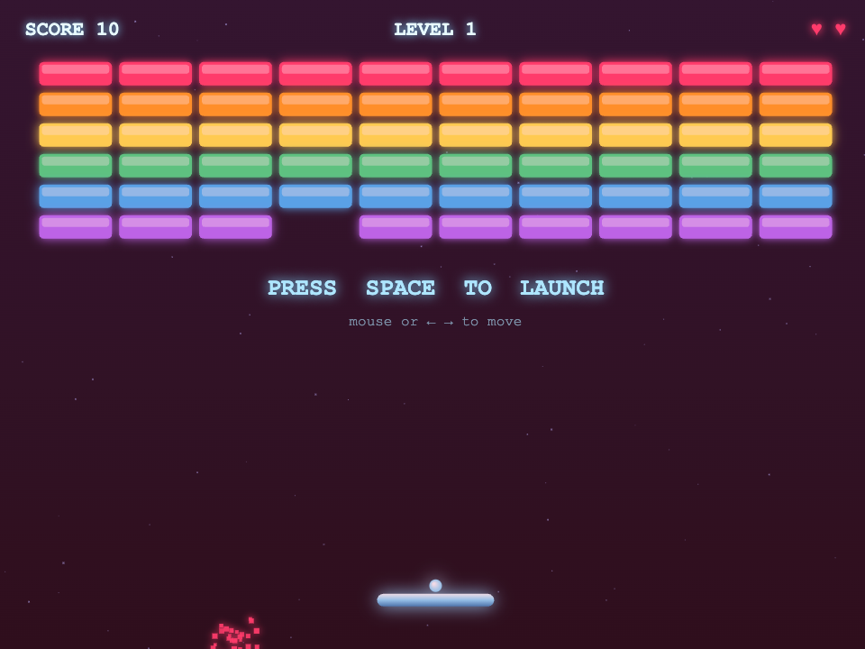

# Agent-12 — the local agent leaderboard

**Which model can actually be your agent on your own hardware?**

Not "which model scores highest on trivia" — which model, running locally on a
machine you can buy, will reliably create the file, fix the bug, rename the
function, and delete the *right* backup. Agent-12 measures that by making
models DO real agent tasks in a sandbox, judged by the filesystem, never by
their prose.

**In one sentence:** Agent-12 runs local LLMs through 20 real agent tasks
(12 easy, 8 hard) in throwaway sandboxes and scores each one by checking the
files the model left behind.

**Proof it works** (from the result files in [`results/`](results/), the same
ones [`build_site.py`](build_site.py) renders into the [live board](https://nicedreamzapp.github.io/agent12/)):

| Model (all on one Apple M5, 128 GB, except the cloud row) | easy | hard |
|---|---|---|
| Qwen3.6-35B-A3B (MLX 8-bit) | 12/12 in 64.2s | 8/8 in 125.2s |
| Qwen3-Coder-30B-A3B (MLX 8-bit) | 12/12 in 42.6s | 7/8 in 391.5s |
| Gemma 4 31B (MLX 4-bit) | 11/12 in 92.1s | 8/8 in 347.9s |
| Qwen3.8-27B (MLX 8-bit) + DFlash 2 drafter | 12/12 in 122.0s | 7/8 in 401.4s |
| DeepSeek V4 Flash (2-bit, ds4.c) | 12/12 in 203.2s | 8/8 in 550.8s |
| Claude Sonnet 5 (cloud reference, same engine) | 12/12 in 122.0s | 8/8 in 131.0s |

A side bench has models write one HTML file that a script then plays in a
headless browser. Qwen3.8-27B's Breakout passed ([writeup](writeups/visual_showdown_2026-09-19.md)):



**Run the winner:** every model on this board plugs straight into
[Claude Code Local](https://github.com/nicedreamzapp/claude-code-local) — Claude Code,
100% on-device on Apple Silicon. Live board: [nicedreamzapp.github.io/agent12](https://nicedreamzapp.github.io/agent12/).
MLX builds of the fighters: [huggingface.co/divinetribe](https://huggingface.co/divinetribe).

**2026-09-19:** Qwen3.8-27B (8-bit) rerun with the DFlash 2 drafter: 12/12 easy and 7/8 hard at roughly 3x the speed of the plain run, still about 3x slower than Qwen3.6-35B-A3B (see `writeups/qwen38_dflash_rerun.md`).

**2026-08-22:** Qwen3.8-27B (8-bit) joins the local table from its own runs (see `writeups/qwen38_vs_qwen36.md`). Muse Glimmer 30B and Nemotron 3 Nano Omni appear in a separate **vendor-reported** section with their publishers' own numbers, credited and linked, until they get a real Agent-12 run.

## What makes this benchmark different

1. **It runs on consumer hardware.** Every local row on the scoreboard was
   produced on a single Apple-silicon machine you can put on a desk. Rows
   report score, wall-clock seconds, and the hardware that produced them.
2. **The harness is part of the experiment.** The same model can score 12/12
   in a lean, per-model-tuned harness and spiral for an hour inside a heavy
   one (7,800-token system prompt, 66 tools). Most benchmarks hide this
   variable; Agent-12 controls it. The reference harness is a ~550-token
   native terminal engine with per-model tool-call dialects; any other
   harness can be plugged in through the `command` adapter and labeled as
   its own row.
3. **Every judge is validated before it judges.** `validate_judges.py` runs a
   known-good reference solution (must pass) and a plausible known-bad
   attempt (must fail) against every task's judge. A judge that fails either
   direction fails the gate with a non-zero exit. The runner does not re-check
   this itself, so run the gate first. This gate has already caught one of our own
   judges demanding behavior that contradicted its own task spec.

## The suites

- **easy (12 tasks)** — everyday agent work: create/run a file, fix a failing
  test, rename across files, extract a config value, precise edits, tricky
  escapes, counting, CSV summing, deleting exactly the right file.
- **hard (8 tasks)** — reasoning under spec pressure: interval merging with
  edge cases, multi-bug debugging with a hash-pinned test file, an LRU+TTL
  cache, CSV parsing with the csv module banned, lexicographic toposort,
  timestamp normalization, a 10-rule validation gauntlet, and a cache-key
  collision hidden behind a red herring.

Anti-cheat: tasks that ship a test file pin its hash — editing the test
scores zero. Judges run the model's artifacts in a fresh subprocess.

## Running it

Requires Python 3.10+. The judges execute the agent's solution with the
interpreter that runs the harness, so on 3.9 (the system `python3` on
macOS) a correct answer using `list[str] | None` is scored as a failure.
`validate_judges.py` refuses to run below 3.10; override deliberately with
`AGENT12_MIN_PYTHON`. Every run records its interpreter in the results.

```bash
# 1. validate the judges (required — the runner assumes this passed)
python3 validate_judges.py

# 2. run a configured model through the reference engine (needs Anvil, see below)
python3 runner.py --suite easy --model qwen3-coder-30b --run qwen30_easy
python3 runner.py --suite hard --model qwen3-coder-30b --run qwen30_hard

# 3. or plug in ANY agent CLI (it gets the same sandboxes and judges)
AGENT12_CMD='your-agent --print {prompt}' AGENT12_MODEL_LABEL='your-model' \
  python3 runner.py --suite easy --adapter command --run yours_easy
```

Step 1 works from a fresh clone with no installs. Step 3 works with any agent
CLI. Step 2 needs the Anvil engine (`agent.py`), which is **not in this repo**:
[`adapters/anvil.py`](adapters/anvil.py) imports it from `AGENT12_ENGINE_DIR`,
plus MLX on Apple silicon and the weights in [`configs/models.json`](configs/models.json).
The visual benches need `websocket-client` and Brave at its macOS path.
`run_task.sh`, `glimmer_night.sh` and `lyric_ab.py` hard-code paths on Matt's
machine and will not run elsewhere as-is.

Discipline: temperature 0, fixed step/token caps per suite, fresh sandbox and
fresh conversation per task, one variable moved per comparison.

## What I built (Matt Macosko)

- [`runner.py`](runner.py): one model, one suite, a fresh sandbox per task.
- [`adapters/`](adapters/): [`anvil.py`](adapters/anvil.py), [`anvil_dflash.py`](adapters/anvil_dflash.py)
  and [`command.py`](adapters/command.py), so any harness can be plugged in.
- [`tasks/easy.py`](tasks/easy.py), [`tasks/hard.py`](tasks/hard.py): 20 tasks, each with a filesystem judge plus known-good and known-bad solutions.
- [`validate_judges.py`](validate_judges.py): the gate that tests every judge before it scores a model.
- [`build_site.py`](build_site.py): renders `results/` into the board at [`docs/index.html`](docs/index.html).
- [`furball_bench.py`](furball_bench.py), [`showdown.py`](showdown.py): the visual benches.
- [`METHODOLOGY.md`](METHODOLOGY.md), [`CONTAMINATION.md`](CONTAMINATION.md), [`writeups/`](writeups/).

The Python floor in [`envcheck.py`](envcheck.py) is from [@galashko](https://github.com/galashko).
Upstream, not built here: the models, MLX and mlx-lm, mlx-dspark and the
DFlash 2 drafter, ds4.c, and Brave.

## Known limits

- The Anvil engine is outside this repo, so model rows cannot be reproduced from this clone alone.
- The held-out pool in [CONTAMINATION.md](CONTAMINATION.md) is private and `build_site.py` does
  not render its contamination flag yet. Board scores come from the 20 public tasks.
- 20 tasks is a small sample. Repeat runs can differ by one task (the `_s2`..`_s4` files in `results/`).

## Docs

- [METHODOLOGY.md](METHODOLOGY.md) — how scoring, judging, and validation work
- [CONTAMINATION.md](CONTAMINATION.md) — public vs held-out tasks, rotation policy

## Report a result or a problem

Ran it on your own hardware, or think a judge got something wrong? Open an [issue](https://github.com/nicedreamzapp/agent12/issues/new) with your chip, RAM, serving stack, model and score. Independent runs are what make the table worth trusting ([#5](https://github.com/nicedreamzapp/agent12/issues/5)).

## Contributors

- [@galashko](https://github.com/galashko) reproduced the Qwen3.6-35B numbers on an M5 Max with a different serving stack ([#1](https://github.com/nicedreamzapp/agent12/issues/1)), found that the judge failed correct code on Python 3.9, and fixed it: runs now record the interpreter and judge validation refuses anything below 3.10 ([#2](https://github.com/nicedreamzapp/agent12/pull/2)).

## License

MIT.
